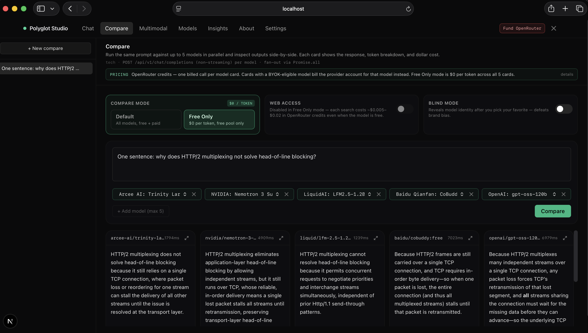

# Polyglot Studio

A local-first Next.js studio that talks to the [OpenRouter](https://openrouter.ai) API — chat with any of 360+ models, compare up to 5 side-by-side on the same prompt, route through the $0 free pool, and run vision models with image attachment. Markdown rendering, persistent per-tab history, per-call token / dollar cost breakdowns, and a personal Insights tab that scores cost-per-good-answer over your actual usage.



> **Unofficial third-party client.** Not affiliated with, endorsed by, or sponsored by OpenRouter Inc. or any model provider. "OpenRouter" is a trademark of its respective owner; this project uses the name only to identify the API it integrates with.

## Tabs

| Tab | What it does | Endpoint |
|---|---|---|
| **Chat** | Single-conversation chat with presets (Auto / Quality / Balanced / Speed / Cost) or manual model selection. Quality preset enables `reasoning.effort=medium`. Default / Free Only mode toggle; web access (server tools) available in Default. | `POST /chat/completions` (streaming) |
| **Compare** | One prompt → 1–5 models in parallel. Per-card breakdown of input / cached / output / reasoning tokens and dollar cost. Includes a Blind mode that hides model identities until you've picked a winner. | `POST /chat/completions` (non-streaming) per model |
| **Multimodal** | Drop / paste / upload images and ask vision-capable models. Defaults to `openrouter/auto` so OpenRouter picks the vision model per request. | `POST /chat/completions` with `text` + `image_url` content blocks |
| **Models** | Searchable catalog: context windows, pricing, modalities, providers. Split into Free pool and Paid catalog. | `GET /models` (cached 10 min) |
| **Insights** | Personal stats over your usage: cost-per-good-answer from your 👍 / 👎 ratings, API-vs-subscription arbitrage math, and a blind-preference profile built from Compare's Blind mode. | client-side, computed from local history |

A **Free Only** mode toggle inside Chat and Compare routes every call through the `:free` pool — random pick from $0 models, rate-limited (≈ 20 RPM; daily caps are higher with $10+ lifetime deposited on your account). Earlier versions had a dedicated Free tab; free-pool routing is now a mode, not a separate tab.

Plus **About** (what the app is for, when to use it) and **Settings** (BYOK registry — record which providers you've BYOK'd at `openrouter.ai/settings/integrations`).

## Prerequisites

- **Node.js 18+** (20+ recommended)
- An **OpenRouter API key** — sign up at https://openrouter.ai and add credits at https://openrouter.ai/settings/credits

## Quick start

```bash
git clone https://github.com/devrathc/polyglot-studio.git
cd polyglot-studio
cp .env.example .env.local
# Open .env.local and paste your OpenRouter API key into OPENROUTER_API_KEY
npm install
npm run dev
```

The dev server auto-opens http://localhost:3000 in your default browser when it's ready. Stop it with the X button in the nav (top-right of the app) or with Ctrl+C in the terminal.

> **Your API key stays on your machine.** It lives in `.env.local` (gitignored) and is only ever read server-side. The browser never sees it. See [SECURITY.md](./SECURITY.md) for the full key-handling model.

## Configuration

`.env.local`:

| Variable | Required | Default | Notes |
|---|---|---|---|
| `OPENROUTER_API_KEY` | yes | — | Your key from https://openrouter.ai/settings/keys. Server-side only — never sent to the browser. |
| `NEXT_PUBLIC_SITE_URL` | no | `http://localhost:3000` | Sent to OpenRouter as the `HTTP-Referer` header (used for analytics on their dashboard). |

Other behavior tuned in code:

- **Per-provider `max_tokens` defaults** — `lib/budget.ts`. Anthropic = 1024, OpenAI = 4096, reasoning models (gpt-5, o-series) = 16384, others = 2048. The server auto-retries with a smaller cap on 402 (insufficient credits) and a larger cap when a reasoning model exhausts its budget on internal thinking.
- **Compare model defaults** — `lib/routing.ts` (`DEFAULT_COMPARE_DEFAULTS`). Currently Opus 4.5, Sonnet 4.6, GPT-5, Gemini 2.5 Pro, Grok 4. A `resolveCuratedDefaults` helper swaps in the newest vendor successor (e.g. `x-ai/grok-4` → `x-ai/grok-4.20`) if an exact id has rotated out of the live catalog.
- **LAN IP allowlist for HMR** — `next.config.ts` (`allowedDevOrigins`). Add your LAN IP if you access the dev server from another device.

## Costs and your API key

Every request you send hits OpenRouter and gets billed against the API key you provide. You are responsible for those charges. Some practical guardrails:

- **Set a monthly cap** on your OpenRouter key at https://openrouter.ai/settings/keys — that's the safest backstop.
- Premium models (Claude Opus, GPT-5, etc.) bill 10–100× more per token than budget models. The Compare tab fans out to all selected models in parallel — a single 500-token comparison across 5 flagship models is typically $0.05–$0.20.
- The **Free** tab uses `openrouter/free` and costs $0 per token, but is rate-limited by OpenRouter (≈ 20 RPM; daily caps are higher with $10+ in your account).
- The cost panel in each tab estimates the call before you send and shows the actual cost after; cross-check against your OpenRouter dashboard for ground truth.

If you have an Anthropic / OpenAI / Google / xAI API key of your own, you can add it at https://openrouter.ai/settings/integrations (BYOK) and OpenRouter will route those models through your provider account; you'll still pay OpenRouter a small (~5%) fee from your OpenRouter credits. Note: a Claude.ai or ChatGPT Plus *subscription* is **not** an API key — those are separate, pay-per-token accounts at the provider's developer console.

## Run as a Mac dock app (optional, macOS only)

`npm run dev` is fine for everyday use, but if you'd rather have a dock icon you can click:

```bash
npm run app:install        # registers a launchd LaunchAgent on port 3030
```

Then in **Safari** (macOS Sonoma 14+):
1. Open `http://localhost:3030`
2. **File → Add to Dock…**
3. Confirm. You get a standalone-window icon in the dock that auto-starts at login.

By default the LaunchAgent runs `next dev`, so code edits hot-reload into the dock window — no rebuild needed. To use a static production build instead:

```bash
npm run app:install:prod   # next build + next start; re-run after every code change
```

Other commands:

```bash
npm run app:status         # is it loaded?
npm run app:restart        # restart the agent (e.g. after editing .env.local)
npm run app:logs           # tail stdout/stderr
npm run app:uninstall      # remove the agent
```

## Project layout

```
app/
  api/
    chat/route.ts          # streaming chat-completions proxy
    compare/route.ts       # parallel multi-model proxy with auto-retry
    models/route.ts        # cached catalog
    credits/route.ts       # OpenRouter credits balance lookup
    leaderboard/route.ts   # opt-in cost-per-good-answer rollup (preview)
    exit/route.ts          # graceful dev-server shutdown
  page.tsx                 # Chat tab
  compare/page.tsx         # Compare tab
  multimodal/page.tsx      # Multimodal tab
  models/page.tsx          # Catalog browser
  insights/page.tsx        # Personal stats (cost per 👍, arbitrage, blind prefs)
  about/page.tsx           # About page
  settings/page.tsx        # BYOK registry
components/                # ChatPanel, CompareView, MultimodalView, InsightsView, AboutView, …
lib/
  openrouter.ts            # OpenAI-SDK client pointed at OpenRouter
  budget.ts                # max_tokens defaults + 402 parsing helpers
  pricing.ts               # cost computation, catalog fetch
  routing.ts               # presets, prompt-routing heuristics, and curated defaults
  byok.ts                  # BYOK registry helpers
  stats.ts                 # Insights aggregations over local history
  sse.ts                   # streaming event parser
  storage.ts               # per-tab session list helpers
scripts/
  dev.mjs                  # dev wrapper that opens the browser
  install-app.sh           # macOS LaunchAgent installer
  uninstall-app.sh
  start-server.sh          # invoked by launchd
```

## Disclaimers

This project is **not affiliated with, endorsed by, or sponsored by** OpenRouter Inc., Anthropic, OpenAI, Google, or any model provider. "OpenRouter" is a trademark of its respective owner; this project uses the name solely for descriptive purposes (it is a UI for the OpenRouter API).

**Third-party client; BYOK.** You bring your own OpenRouter account and API key. This app does not resell API access, aggregate routing on its own, scrape the Site, or attempt to reverse-engineer the Service — it uses only public, documented OpenRouter API endpoints. Your use of the OpenRouter API through this app is governed by [OpenRouter's Terms of Service](https://openrouter.ai/terms) between you and OpenRouter, Inc.

**API costs are your responsibility.** This app sends your prompts to OpenRouter using the API key you provide. You are billed by OpenRouter for every request. The author is not responsible for any charges incurred. Set a monthly limit on your OpenRouter key.

**No warranty.** Provided "as is" under the [MIT License](./LICENSE). The auto-retry and `max_tokens` heuristics are best-effort; verify costs against your OpenRouter dashboard.

**Local-only.** This is designed to run on your own machine. It is not multi-tenant; do not deploy it as a public service without adding authentication, rate limiting, and per-user billing — none of which are included.

## License

[MIT](./LICENSE) — see the LICENSE file for full text.

## More

For the deeper write-up on what I learned building this — OpenRouter's billing model, the four-layer cost stack, engineering decisions, failure modes and cost intuition — see [LEARNING.md](./LEARNING.md).

For contribution guidelines see [CONTRIBUTING.md](./CONTRIBUTING.md); for the security/key-handling model and how to report issues see [SECURITY.md](./SECURITY.md).
